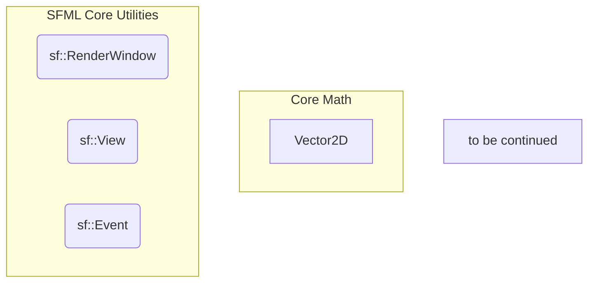

# 2D Physics Simulator Visualizer
A real-time 2D physics simulation visualizer build in C++ and SFML. This project aims to provide a platform for experimenting with rigid body physics, collision detection and response in a praghical environment.

## Table of Contents

- [2D Physics Simulator Visualizer](#2d-physics-simulator-visualizer)
  - [Table of Contents](#table-of-contents)
  - [Features](#features)
  - [Architecture Overview](#architecture-overview)
    - [Internal Architecture](#internal-architecture)
    - [Project Directory](#project-directory)
  - [Prerequisites](#prerequisites)
  - [Building \& Running the Project](#building--running-the-project)
    - [CMakeLists.txt Configuration](#cmakeliststxt-configuration)
    - [Platform-Specific Build Instructions](#platform-specific-build-instructions)
      - [Windows (MSVC)](#windows-msvc)
      - [Linux (GCC/Clang)](#linux-gccclang)
      - [macOS (Clang)](#macos-clang)
    - [Executing](#executing)
  - [Troubleshooting](#troubleshooting)
  - [Contributions](#contributions)
  - [License](#license)


## Features
- **Real-time 2D Physics Simulation:** Simulate interactions between various 2D shapes in a graphical environment.
- **Collision Detection:** Implement collision detection between objects using several broad phase and narrow phase algorithms.
- **Collision Response:** Apply realistic responses to collisions utilizing advanced physics equations.
- **SFML Graphics:** Utilizes the Simple and Fast Multimedia Library (SFML) for efficient rendering of the graphical environment.
- **Modern CMake & FetchContent:** Automatically fetches and builds SFML from source, ensuringseamless cross-platform compatibility andsimplifying the dependancy management.


## Architecture Overview
The project is structured around several key components designed for modularity and scalanility, leveraging Object-Oriented-Programming (OOP) principles and concepts such as polymorphism and inheritance.

### Internal Architecture


### Project Directory
```bash
physics_visualizer_2d/
├── src/
│   ├── main.cpp
│   ├── physics/
│   │   └── PhysicsEngine.cpp
│   │   └── Solid.cpp
│   │   └── Circle.cpp
│   │   └── Square.cpp
│   ├── graphics/
│   │   └── Renderer.cpp
│   └── input/
│       └── InputHandler.cpp
│   └── SimulatorApp.cpp
├── include/
│   ├── math/
│   │   └── Vector2D.hpp
│   ├── physics/
│   │   └── Solid.hpp
│   │   └── Circle.hpp
│   │   └── Square.hpp
│   ├── graphics/
│   │   └── Renderer.hpp
│   └── input/
│       └── InputHandler.hpp
│   └── SimulatorApp.hpp
├── build/  (Generated by CMake - ignored by Git)
├── .gitignore
├── CMakeLists.txt
├── LICENSE
└── README.md
```


## Prerequisites
To build and run the project, you will need:
- **Git:** For cloning the repository.
  - [Download Git](https://git-scm.com/downloads)
- **CMake (version 3.28 or newer):** The cross-platform build system generator.
  - [Download CMake](https://cmake.org/download/)
- **A C++ Compiler:**
  - **Windows:** Visual Studio 2022 (Community Edition is recommended). Ensure the "Desktop development wirh C++" workload is installed.
    - [Download Visual Studio](https://visualstudio.microsoft.com/downloads/)
  - **Linux:** GCC or CLang (typically installed vai your distribution's package manager, e.g., `build-essential` for Ubuntu).
  - **macOS:** Xcode Command Line Tools (provides Clang). Install with `xcode-select --install`.
  
**Important for Windows users:** Your compiledprogram will depend on the **Visual C++ Redistributable for Visual Studio 2015-2022 (x86)**. It's good practice to ensure this is installed or repaired on your system.

   - [Download](https://learn.microsoft.com/en-us/cpp/windows/latest-supported-vc-redist?view=msvc-170) `vc_redist.x86.exe` (Look for "x86: vc_redist.x86.exe" under "Visual Studio 2015-2022").


## Building & Running the Project
This project leverages CMake's `FetchContent` module to automatically download and build SFML 3.0.1 directly from its source repository. This guarantees that SFML is compiled with your specific compiler, eliminating binary compatibility issues often encountered wuth pre-built libraries.

### CMakeLists.txt Configuration
The `CMakeLists.txt` handles all dependency fetching and project setup. Here's the core configuration:
```bash
cmake_minimum_required(VERSION 3.28)
project(2DPhysicsVisualizer LANGUAGES CXX)

set(CMAKE_RUNTIME_OUTPUT_DIRECTORY ${CMAKE_BINARY_DIR}/bin)

# Automatically fetching all SFML modules and dependencies
include(FetchContent)
FetchContent_Declare(SFML
    GIT_REPOSITORY https://github.com/SFML/SFML.git
    GIT_TAG 3.0.1
    GIT_SHALLOW ON
    EXCLUDE_FROM_ALL
    SYSTEM)
FetchContent_MakeAvailable(SFML)

# Creating the executable and linking the SFML libraries
add_executable(2DPhysicsVisualizer src/main.cpp)
target_compile_features(2DPhysicsVisualizer PRIVATE cxx_std_17)
target_link_libraries(2DPhysicsVisualizer PRIVATE SFML::Graphics)
```

### Platform-Specific Build Instructions
Regardless of your operating system, all build steps should be performed from your project's root directory (`2D-Physics-Simulator/`).

**First Step for All Platforms:**
1. **clone the Repository:**
```bash
git clone https://github.com/gu1lherme78965/2D-Physics-Simulator.git
cd 2D-Physics-Simulator
```

2. **Create and avigate to the Build Directory:**
```bash
mkdir build
cd build
```

#### Windows (MSVC)
3. **Open Developer Command Prompt for VS 2022:**
   - Search for "Developer Command Prompt for VS 2022" in your Windows Start Menu and open it. All subsequent commands must be run in this terminal to endure `cl.exe` and related tools are in your PATH.

4. **Configure the Projecy with CMake:**
```bash
cmake .. -G "Visual Studio 17 2022" -A Win32
```
   - `-G "Visual Studio 17 2022"`: Generates Visual Studio 2022 solution files.
   - `-A Win32`: Specifies the 32-bit (x86) architecture for the generated projects.

5. **Build the Project:**
```bash
cmake --build . --config Debug
```
   - `--config Debug`: Builds the Debug configuration. For an optimized build, use `--config Release`.

#### Linux (GCC/Clang)
3. **Open your Systems terminal.**

4. **Configure the Project with CMake:**
```bash
cmake .. -G "Unix Makefiles"
# OR for faster builds (if Ninja is installed):
cmake .. -G "Ninja"
```

5. **Build the Project:**
```bash
cmake --build .
```
   - On Unix-like systems, `cmake --build .` typically builds the `Debug` configuration by default if `CMAKE_BUILD_TYPE` is not explicitly set during configuration (e.g., `cmake --build . -DCMAKE_BUILD_TYPE=Release`).

#### macOS (Clang)
3. **Open Terminal.app.**

4. **Configure the Project with CMake:**
```bash
cmake .. -G "Xcode"
# OR for command-line builds:
cmake .. -G "Unix Makefiles"
# OR for faster builds (if Ninja is installed):
cmake .. -G "Ninja"
```

5. **Build the Project:**
```bash
cmake --build . --config Debug
```
   - `--config Debug`: Required for Xcode generator. For `Unix Makefiles` or `Ninja`, you might omit `--config Debug` for a default buid type, or specify `-DCMAKE_BUILD_TYPE=Debug` during configuration.

### Executing
After a successful build, your executable will be located in the `build/bin/Debug` (for Debug builds) or `build/bin/Release` (for Release builds) directory.
1. **Navigate to the Executable Directory:**
   (Ensure you are in the terminal used for building)
```bash
# For Debug build:
cd bin/Debug
# For Release build:
cd bin/Release
```

2. **Run the Executable:**
   - **Windows**
      ```bash 
      .\2DPhysicsVisualizer.exe
      ```
   
   - **Linux/macOS**
      ```bash
      ./2DPhysicsVisualizer
      ```

   A new window should appear sisplaying the 2D physics simulation.


## Troubleshooting
If you encounter issues during building or running, here are some common problems and their solutions:

- **`cmake` or `cl.exe` (Windows) / `g++` (Linux) / `clang++` (macOS) not found:**
  - Ensure the respective tools are installed and their executables are in your system's PATH.
  - On Windows, always use the "Developer Command Prompt for VS 2022".

- **Compiler/Linker errors during `cmake --build`:**
  - **cannot open source file "SFML/Graphics.hpp":** Your `CMakeLists.txt`'s `target_inlcude_directories` fro SFML might be incorrect. Double-check the explicit path you added for SFML headers if you customized it.
  - **`LNK` errors (Windows) / `undefined references` (Linnux/macOS):** This typically mean a library is not linked correctly. With `FetchContent`, this is less common but ensure `target_link_libraries(${PROJECT_NAME} PRIVATE SFML::Graphics)` is correct.
  - **SFML API Mismatch:** If you switched `GIT_TAG` to another version of SFML but still use the 3.x API, you'll get compilation errors. Refer to the [SFML Documentation](https://www.sfml-dev.org/documentation/3.0.1/).

- **Executable runs but "nothing happens":**
  - **Missing Runtime DLL's (Windows):** Although `FetchContent` helps, ensure the SFML DLLs are present in the same directory as your executable (`build/bin/Debug` or `build/bin/Release`). CMake often handles this, but a manual copy from `SFML-git-build-directory/bin` ( `SFML-git-build-directory` is where SFML was built from by `FetchContent`) to your output directory might be needed if not automatically placed.
  - **Visual C++ Redistributable (Windows):** Re-run the `vc_redist.x86.exe` installer (from prerequisites) and choose "Repair" or "Install".
  - **Graphics Drivers:** Ensure your graphics drivers are up to date. SFML relies on OpenGL.
  - **Minimal `main.cpp` Test:** Temporarily simplify your `src/main.cpp` to the absolute bare minimum SFML window creation code to isolate if the issue is with your physics code or SFML's basic initialization.

- **VS Code Squiggles (`C/C++(1696) errors` for SFML headers):**
  - These are IntelliSense errors, not compilation errors. If `cmake --build` works, your code is compiling.
  - In VS Code: Open Command Palette (`Ctrl+Shift+P`), type `CMake: Configure` and select it. Then `C/C++: Reset IntelliSense Cache` and `C/C++: Rescan Workspace`. This usually resolves them.


## Contributions
Contributions are very welcome! Whether you're fixing a bug, adding a new feature, improving documentation, or just providing feedback, your help makes this project better.

**How to contribute:**
1. **Fork the Repository:** Start by forking the `2D-Physics-Simulator` repository on GitHub.

2. **Create an Issue (Optional, but Recommended):** If you're working on a new feature or a significant bug fix, it's a good idea to open an issue first to discuss it. This helps avoid duplicate work and ensures your contribution aligns with the project's goals.

3. **Clone your Fork:**
   ```bash 
   git clone https://github.com/gu1lherme78965/2D-Physics-Simulator.git
   cd 2D-Physics-Simulator
   ```

4. **Create a New Branch:**
   ```bash
   git checkout -b feature/your-feature-name # For new features
   # OR
   git checkout -b bugfix/issue-description # For bug fixes
   ```

5. **Make Your Changes:** Implement your feature or fix the bug.
   - **Readability & Clarity:** Please ensure your code is clear, well-commented, and easy to understand. Prioritize readability.
   - **Concise Commits:** Make small, focused commits with clear and descriptive messages.

6. **Test Your Changes:** Before submitting, make sure your changes compile and run without introducing new issues.

7. **Push Your Branch:**
   ```bash
   git push origin feature/your-feature-name
   ```

8. **Open a Pull Request (PR):**
   1. Go to your forked repository on GitHub.
   2. You should see a "Compare & pull request" button. Click it.
   3. Provide a clear title and description for your PR, referencing any related issues.

Thank you for helping to improve the 2D Physics Simulator!


## License
This project is under the **MIT License**, for more information refer to the **LICENSE** file in the repository.